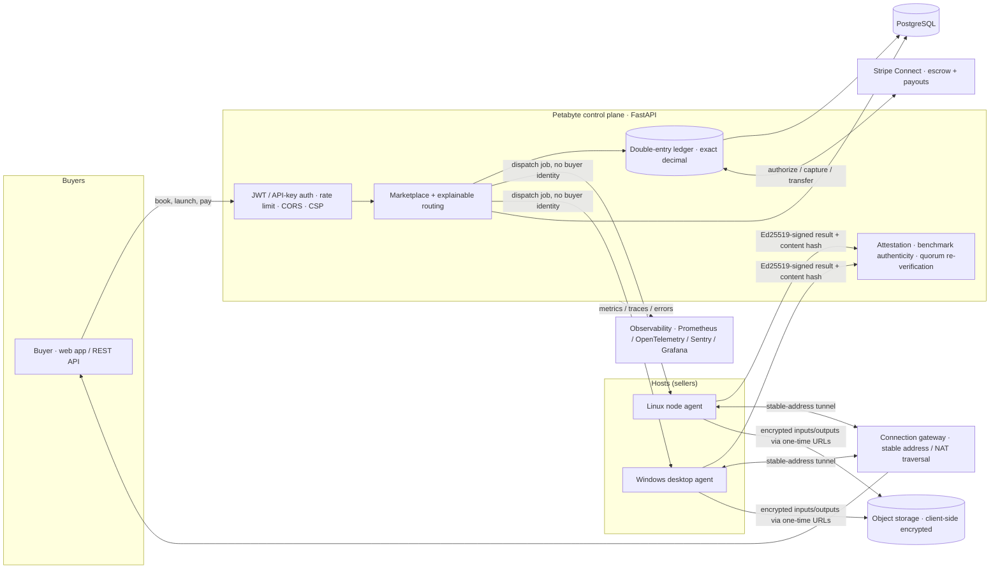

# Petabyte

**A trust layer for renting compute from strangers.** Petabyte aggregates fragmented,
underutilized GPU/CPU supply — gaming rigs, workstations, idle datacenter cards — verifies
and normalizes it, and routes workloads by price, performance, availability, and *trust*.
Buyers get cheaper compute with a receipt they can verify; hosts monetize idle hardware;
Petabyte takes a fee on **successfully delivered, verified** compute.

The hard problem in this market is not matching supply to demand — it is **trust**: proving
a remote machine is the GPU it claims, that it actually did the work, that the buyer's money
is safe, and that neither side can cheat the other. That verification stack is the product
and the moat. We build it honestly and say plainly what is enforced in code versus what still
needs hardware — see [`docs/TRUST_MODEL.md`](docs/TRUST_MODEL.md) and
[`docs/PRODUCTION_GAPS.md`](docs/PRODUCTION_GAPS.md).

- **Verify, don't trust:** live transparency counts + a per-job cryptographic receipt at `/trust`.
- **Report a vulnerability:** [`SECURITY.md`](SECURITY.md) — coordinated disclosure, safe harbor.

---

## System architecture



## The trust flow (the moat, one sequence)

```mermaid
sequenceDiagram
  participant Buyer
  participant API as Petabyte API
  participant Escrow as Ledger + Stripe
  participant Host as Host agent
  participant Peers as Independent nodes

  Buyer->>API: Book GPU (hours)
  API->>Escrow: Move funds to escrow (authorize)
  API->>Host: Dispatch job (no buyer identity in payload)
  Host->>Host: Run in container (cap-drop, no host FS, egress-firewalled)
  Host->>API: Ed25519-signed result + sha256(output bytes)
  API->>API: Verify signature vs attested key (forgery ⇒ freeze payouts)
  opt sampled deterministic jobs
    API->>Peers: Re-execute; compare content hashes (quorum)
    Peers-->>API: Divergent hash ⇒ freeze the faker
  end
  API->>Escrow: Capture; hold payout (fraud-catch window)
  API-->>Buyer: Verifiable receipt (signature, hash, re-verification)
```

Every arrow above is enforced in code with tests; the honest boundaries (what needs a
hardware TEE, what is host-reported) are documented, not glossed.

---

## Quickstart

### One command with Docker

```bash
docker compose up --build
# → API + PostgreSQL. Open http://localhost:8000
#   /docs   interactive OpenAPI      /trust  live transparency + receipts
#   /health/ready  readiness         /security.txt  disclosure policy
```

The compose file ships **insecure dev defaults** so it boots with zero setup; override
`SECRET_KEY` / `SERVER_PRIVATE_KEY` (and generate fresh keys) for anything real — see the header
of [`docker-compose.yml`](docker-compose.yml). Payments stay in **sandbox** mode; live money is
gated behind `PAYMENTS_LIVE_ENABLED` + real Stripe keys.

### Seeded investor demo (no Docker, no GPU)

```bash
make investor-demo     # validate deps → build schema → seed labelled demo data → serve
make demo-reset        # wipe and start clean
```

All seeded entities are labelled **"Demo data"** and stay separable from real data everywhere
(GMV/metrics exclude them). Walkthrough: [`docs/PRODUCT_DEMO.md`](docs/PRODUCT_DEMO.md).

### Live investor / YC demos

Running the two-sided marketplace live (real Stripe **TEST** mode, real GPU nodes) — including
the multi-node **distributed** demo (one buyer, two GPU VMs, one job across both) — is documented
in one place: [`docs/demo/yc/`](docs/demo/yc/README.md).

### Local dev (bare)

```bash
cd lumaris_api
cp .env.example .env          # then fill required secrets
pip install -r requirements.txt
uvicorn main:app --reload     # http://localhost:8000/docs
```

---

## API overview

FastAPI serves interactive OpenAPI at **`/docs`** (and the raw schema at `/openapi.json`).
Representative surface:

| Area | Endpoints |
|---|---|
| **Auth** | `POST /register_user`, `POST /login` (JWT), `POST /create_api_key` (node key), Google OAuth2 |
| **Marketplace** | `GET /marketplace/specs`, `GET /marketplace/specs/{id}`, `POST /route` (explainable), `POST /solve` |
| **Compute lifecycle** | `POST /request_vm` (escrow), `POST /create_task`, `GET /jobs/next` (agent), `POST /jobs/result` (signed) |
| **Payments** | `GET /payments/config`, Stripe Connect onboarding, webhooks, metered VM billing, payout batches |
| **Trust & transparency** | `GET /trust/summary`, `GET /jobs/{id}/receipt` (verifiable), `POST /jobs/benchmark_result` (server-timed) |
| **Ops / health** | `GET /healthz`, `GET /health/ready`, `GET /marketplace/health`, Prometheus metrics |

Auth is JWT for humans and per-node API keys (Fernet-sealed) for agents; every result an agent
submits is Ed25519-signed and bound to the hardware key attested at enrolment.

---

## Security & compliance readiness

Enforced in code today (each with tests):

- **AuthN/AuthZ** — JWT + bcrypt, per-node API keys, tenant isolation, IDOR-closed object refs.
- **Edge hardening** — global rate-limit middleware, CORS allow-list, and security headers
  (`Content-Security-Policy`, `HSTS`, `X-Frame-Options: DENY`, `nosniff`); trusted-proxy-aware
  client-IP resolution (no `X-Forwarded-For` spoofing).
- **Input validation** — Pydantic models with bounds/charset validation on every write path;
  server-side output escaping (no stored XSS).
- **Money safety** — exact-decimal double-entry ledger, idempotent settlement, money conservation
  proven under concurrent writers on PostgreSQL; live money gated behind explicit config.
- **Secrets** — nothing committed (`.env` git-ignored, `template.env` is the contract), a config
  manifest + drift check in CI, fail-closed loading, rotation runbook.
- **Supply chain / disclosure** — `pip-audit` + `gitleaks` in CI, a signed agent auto-update
  channel, and a published coordinated-disclosure policy with `security.txt`.
- **Workload isolation** — buyer code runs only in containers with dropped capabilities, no host
  FS/socket, a host egress firewall (blocks cloud-metadata + LAN), and localhost-only service ports.

Honestly **not yet** enterprise-certified: SOC 2 / ISO 27001, a published external pentest, real
vendor TEE attestation (the verifier is fail-closed until one is wired), and KYC/AML. These are
tracked in [`docs/PRODUCTION_GAPS.md`](docs/PRODUCTION_GAPS.md) and
[`docs/TRUST_MODEL.md`](docs/TRUST_MODEL.md) — we would rather be trusted than impressive.

---

## Monorepo layout

| Path | What it is |
|---|---|
| `lumaris_api/` | FastAPI control plane + web app (marketplace, routing, ledger, auth, trust, admin, metrics) |
| `lumaris_agent/` | Linux seller node agent — registers, attests, heartbeats, runs jobs in Docker |
| `desktop-app/` | Windows-packaged agent |
| `lumaris_gateway/` | Stable-address connection gateway (NAT traversal + failover) |
| `observability/` | Prometheus / Grafana / OTel collector stack + provisioning |
| `Dockerfile`, `docker-compose.yml` | Production image + one-command local stack |
| `.github/workflows/` | CI: SQLite + Postgres suites, config drift, frontend contract, demo, clean-DB migration, container build, lint, `pip-audit` + `gitleaks` |
| `docs/` | Technical due-diligence package (below) |

Package names retain the original `lumaris_*` prefix; the product is Petabyte (rename tracked as hygiene).

## Technical due-diligence package

| Document | Purpose |
|---|---|
| [`docs/INVESTOR_TECHNICAL_BRIEF.md`](docs/INVESTOR_TECHNICAL_BRIEF.md) | The system in one read for a technical adviser |
| [`docs/ARCHITECTURE.md`](docs/ARCHITECTURE.md) | Components, money model, trust ladder, isolation |
| [`docs/TRUST_MODEL.md`](docs/TRUST_MODEL.md) | What's enforced in code vs. what needs hardware |
| [`docs/DATA_FLOW.md`](docs/DATA_FLOW.md) | End-to-end flow with endpoints and ledger legs |
| [`docs/THREAT_MODEL.md`](docs/THREAT_MODEL.md) | Adversaries, mitigations, unresolved items |
| [`docs/PRODUCTION_GAPS.md`](docs/PRODUCTION_GAPS.md) | Honest what's-not-ready, by milestone |
| [`docs/ROADMAP.md`](docs/ROADMAP.md) | Sequenced plan and where the moat compounds |
| [`SECURITY.md`](SECURITY.md) · `RUNBOOK.md` | Disclosure policy · deploy/operate runbook |

## Run the tests

```bash
cd lumaris_api && python smoke_test.py        # fast SQLite signal
bash run_tests.sh --postgres                   # both engines (what CI runs)
```

CI ([`.github/workflows/tests.yml`](.github/workflows/tests.yml)) runs the full suite on SQLite
**and** PostgreSQL (money precision + real races), plus config-drift, frontend/backend contract,
investor-demo honesty, clean-DB migration, a **container build + health check**, `ruff`,
`pip-audit`, and `gitleaks`.

---

Built in Riyadh · [petabyte.market](https://petabyte.market)
