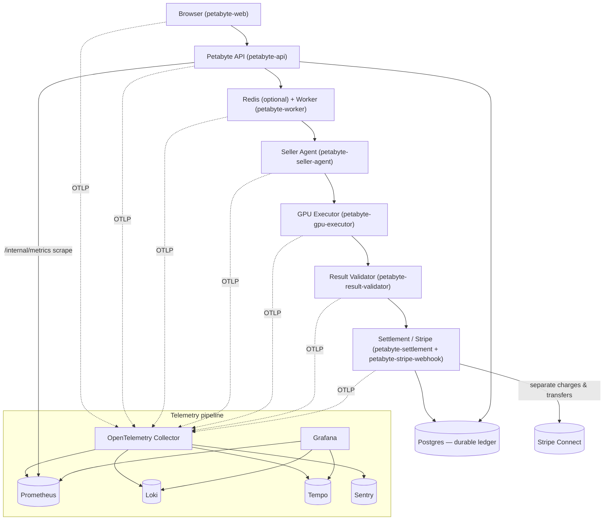

# Observability Architecture

How Petabyte is instrumented end to end, and how a single request/transaction is
correlated across every service, metric, log, and trace.

Petabyte is a FastAPI monorepo:

- **`lumaris_api/`** — the platform API (`petabyte-api`). Also hosts the worker,
  scheduler, Stripe webhook handler, and settlement logic as logical services.
- **`lumaris_agent/`** — the seller GPU agent (`petabyte-seller-agent`) running on
  each seller's machine; it heartbeats, polls `/jobs/next`, executes jobs, and reports
  results.
- **`lumaris_gateway/`** — the VM/tunnel gateway.

Postgres is the durable ledger and the permanent financial record. Redis is
**optional** — when absent the platform degrades to in-process coordination.

The instrumentation core lives in `lumaris_api/observability.py`. Its design rules:
telemetry is **import-safe and degrade-safe** (never breaks settlement or job
execution — `OBSERVABILITY_FAILURE_MODE=degrade`), there is **one correlation model
everywhere** (contextvars), logs are **structured JSON with centralized redaction**,
and Prometheus labels are drawn from **small controlled enumerations only** (bounded
cardinality — no id is ever a metric label).

## Canonical services

These are the `service.name` (OTLP) and Loki `service` label values:

| Service | Name | Role |
|---|---|---|
| Web | `petabyte-web` | Browser-facing UI surface |
| API | `petabyte-api` | Platform FastAPI (quotes, auth, payments, jobs) |
| Worker | `petabyte-worker` | Dispatch / background processing |
| Scheduler | `petabyte-scheduler` | Reaper / periodic maintenance |
| Stripe webhook | `petabyte-stripe-webhook` | Authoritative async payment events |
| Seller agent | `petabyte-seller-agent` | On the seller's GPU node |
| GPU executor | `petabyte-gpu-executor` | Runs the job container on the GPU |
| Result validator | `petabyte-result-validator` | Verifies job output before capture |
| Settlement | `petabyte-settlement` | Capture, commission, seller transfer |

## Data flow and telemetry fan-in

Notes on the pipeline:

- **All services → OTLP → OpenTelemetry Collector → {Prometheus, Loki, Tempo,
  Sentry}.** The Collector is the single fan-in point.
- **Prometheus** also scrapes the API's protected `/internal/metrics` endpoint
  directly (pull), in addition to any OTLP metrics path.
- **Grafana → {Prometheus, Loki, Tempo}** is the read path for humans; it links
  Loki → Tempo by `trace_id` so you can jump from a log line to its trace.
- **Sentry** receives errors/exceptions for alerting and stack traces.
- GPU node metrics come from **DCGM** exporters (`DCGM_FI_DEV_GPU_TEMP`,
  `DCGM_FI_DEV_GPU_UTIL`, `DCGM_FI_DEV_XID_ERRORS`) scraped into Prometheus.

## Correlation model

There is one correlation vocabulary, propagated via contextvars
(`observability.CONTEXT_KEYS`) and W3C trace-context across process/machine
boundaries (`inject_context` / `span(carrier=...)`). The golden rule: **business ids
live in log/trace bodies, never as metric labels** (bounded cardinality).

| Id | Where it comes from | Where it lives |
|---|---|---|
| `request_id` | Generated per HTTP request (or sanitized from inbound header) | Log field, span attr |
| `trace_id` / `span_id` | W3C trace context (OTel) | Log field + Tempo trace |
| `transaction_id` | `ComputeTransaction.public_id` | Log field, span attr |
| `job_id` | Job / task id | Log field, span attr |
| `reservation_id` / `booking_id` | GPU reservation / booking | Log field, span attr |
| `buyer_id` / `seller_id` | User ids | Log field, span attr |
| `gpu_id` / `agent_id` | Seller node / GPU | Log field, span attr |
| `template_name` / `template_version` | Workload template | Log field, span attr |
| `payment_intent_id` / `charge_id` / `transfer_id` / `refund_id` | Stripe object ids | Log field, span attr |
| `webhook_event_id` | `StripeWebhookEvent` id | Log field, span attr |
| `data_class` | Data-sensitivity tag for redaction | Log field |

Because every service shares this vocabulary and the W3C trace context flows across
the API → Redis/worker → agent → executor → validator → settlement chain, a single
`transaction_id` is enough to reconstruct the full flow across logs (Loki), traces
(Tempo), and corroborating metrics (Prometheus). See `TRANSACTION_TRACE_GUIDE.md`.

## Health surfaces

- `/healthz` — liveness (process up).
- `/readyz` — readiness (DB reachable); 503 if Postgres is down.
- `/health/live` / `/health/ready` — richer liveness/readiness; `/health/ready` also
  reports maintenance/reaper freshness (`maintenance.stale`).
- `/health/observability` — telemetry integration health (tracing/metrics/logging
  active?, endpoint configured?, sample ratio, failure mode).
