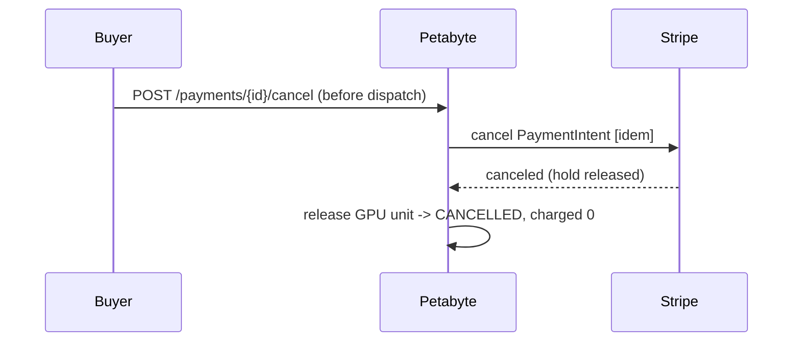

# Payment Flow

The buyer-facing lifecycle of a paid compute job, and the state machine behind it.

## State machine

```
DRAFT
 → PAYMENT_REQUIRES_ACTION      (PaymentIntent created; buyer must confirm card)
 → PAYMENT_AUTHORIZED           (card authorized — verified server-side, not by redirect)
 → GPU_RESERVED                 (atomic capacity reservation)
 → DISPATCHING → RUNNING        (idempotent job dispatch)
 → METERING_FINALIZED           (trusted server-side usage recorded)
 → PAYMENT_CAPTURE_PENDING
 → PAYMENT_CAPTURED             (captured ACTUAL usage; unused authorization released)
 → SELLER_TRANSFER_PENDING
 → SELLER_TRANSFERRED           (net transferred to the connected account, once)
 → COMPLETED
```

Failure / terminal states: `PAYMENT_FAILED`, `AUTHORIZATION_EXPIRED`,
`RESERVATION_FAILED`, `DISPATCH_FAILED`, `JOB_FAILED`, `CAPTURE_FAILED`,
`TRANSFER_FAILED`, `CANCELLED`, `REFUND_PENDING`, `REFUNDED`, `DISPUTED`.

Transitions are validated in `stripe_connect.transition()`; any jump not in the
table raises. `financial reconciliation status` is tracked **separately** from this
customer-facing job state.

## What the browser may and may not do

The browser sends at most: a GPU public id, a workload template, and a max-runtime
preference. It receives only the PaymentIntent **client secret** and safe display
values. It **never** determines the hourly rate, authorization amount, final amount,
platform fee, seller net, or the connected-account destination — all computed
server-side from the immutable pricing snapshot.

## Distinct amounts (never conflated in the UI)

- **Estimated cost** — `estimated_compute_amount` (price × estimated seconds).
- **Authorized maximum** — `authorization_amount` (estimate + safety margin). A hold,
  **not** a completed payment.
- **Final captured amount** — `captured_amount` (price × ACTUAL metered seconds,
  capped at the authorization).

## Partial capture (usage < estimate)

```mermaid
sequenceDiagram
    participant P as Petabyte
    participant S as Stripe
    Note over P: authorized 300 (est 1h + 20%)
    P->>P: metered 1800s (30m) -> settle -> capture 125
    P->>S: capture amount_to_capture=125 [idem petabyte:capture:{tx}:{v}]
    S-->>P: succeeded, amount_received=125, capturable=0 (175 auth released)
    P->>P: ledger DEBIT external:payments:minor 125; CREDIT platform_revenue:minor 12 + seller_payable 113
```

## Job never starts (fair-failure policy)

If the job never runs (buyer cancels pre-dispatch, or reservation/dispatch fails):
cancel the PaymentIntent authorization, release the GPU, **charge the buyer nothing**.



## Job starts but fails (documented default policy)

- Failure caused by seller/GPU/Petabyte **before meaningful execution** → no charge
  (cancel authorization, release GPU). Recorded with a failure category.
- **Partial useful execution** → capture only the verified metered usage.
- **Never** pay the seller for unverified or fraudulent usage.
- Zero billable usage → `capture()` routes to cancel (charge $0), never silently
  captures the maximum authorization.

## Endpoints (authorization in parentheses)

| Method | Path | Who | Purpose |
|---|---|---|---|
| POST | `/payments/quote` | buyer | Server-side quote |
| POST | `/payments/authorize` | buyer | Create tx + manual-capture PaymentIntent |
| POST | `/payments/{id}/confirm` | buyer (owner) | Reconcile authorization server-side |
| GET | `/payments/{id}` | buyer/seller/admin | Transaction state |
| GET | `/payments/{id}/receipt` | buyer/seller/admin | Receipt (est vs auth vs captured) |
| POST | `/payments/{id}/cancel` | buyer (owner) | Cancel before dispatch |
| POST | `/admin/payments/{id}/{reserve,dispatch,meter,capture,transfer,refund}` | admin/service | Internal settlement ops |
| GET | `/admin/payments`, `/admin/payments/{id}`, `/admin/webhooks` | admin | Financial dashboard |
| POST | `/webhooks/stripe` | Stripe | Signed, at-most-once event intake |
