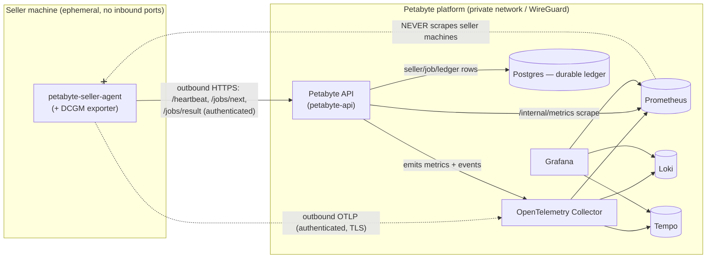

# Seller Observability (Ephemeral GPU Fleet)

How Petabyte observes a marketplace of **ephemeral** seller GPUs it does not own or
control. Seller machines connect, disconnect, reboot, and disappear at will. The
platform never reaches *into* them — it observes seller activity **only from the
agent's own authenticated outbound calls**, so a seller needs no inbound ports, no
public IP, and no firewall entry, and offline is inferred from **heartbeat expiry**
rather than a failed probe.

This is the marketplace-wide, supply-side companion to the money-path docs. For the
full metric/`event_name` contract see `docs/OBSERVABILITY_DATA_DICTIONARY.md`; for the
"a seller went dark" response see `docs/runbooks/SELLER_AGENT_OFFLINE.md`.

## The model in one paragraph

A seller installs the `petabyte-seller-agent`, which registers a GPU spec and then
**calls out** to the platform on a loop: it posts `/heartbeat`, polls `/jobs/next`,
and uploads results. Every one of those calls is authenticated (Ed25519-attested spec,
bearer credentials) and *originates from the seller*. The platform records what it sees
on those calls as metrics (Prometheus, bounded labels only) and structured logs/traces
(Loki/Tempo, ids in the body). Because observation rides the seller's outbound
connection, the platform needs no route back to the seller's machine. When the outbound
calls stop, the heartbeat goes stale, the reaper removes the spec from supply, and the
GPU simply drops out of the marketplace — no alarmed "host down" page, because ephemerality
is the normal state.

## Outbound-only telemetry path



Key properties of this path:

- **The platform is always the callee, the seller is always the caller.** Heartbeats,
  job pulls, and result uploads are outbound from the agent. The platform derives all
  supply-side observability from *observing those inbound-to-us requests*.
- **The API is the observation point.** It translates authenticated seller calls into
  bounded-cardinality metrics and structured `event_name` logs, then exports over OTLP
  to the Collector (the single fan-in), which fans out to Prometheus / Loki / Tempo.
  Prometheus additionally scrapes the API's own `/internal/metrics` endpoint.
- **GPU hardware telemetry (DCGM) is also outbound.** The DCGM exporter's series reach
  the platform via the agent's authenticated OTLP push, not by Prometheus reaching in.

## Why Prometheus does not scrape sellers

Classic Prometheus observability is **pull**: Prometheus opens a connection *to* each
target and scrapes `/metrics`. That model is wrong for an ephemeral, untrusted,
NAT'd fleet, so Petabyte does **not** use it for sellers:

- **No inbound ports on seller machines.** Sellers do not expose a scrape endpoint.
  There is nothing for Prometheus to connect to, and nothing for an attacker to reach.
- **No firewall / allowlist entry per seller IP.** Because the platform never initiates
  a connection to a seller, no seller IP is ever added to a platform ingress rule.
  Sellers behind NAT, CGNAT, or dynamic IPs work unchanged.
- **No target churn.** A pull model would need Prometheus service-discovery to add and
  remove thousands of short-lived targets as sellers appear and vanish — every reboot a
  "target down". Instead, supply is a **scrape-time marketplace collector** on the
  platform that reports aggregate gauges (e.g. `petabyte_sellers_online`) with bounded
  labels only. One stable scrape target (the API), no per-seller series.
- **Trust boundary stays clean.** The platform treats every seller as adversarial
  (see `docs/SELLER_ANTIFRAUD.md`). Not connecting to seller machines means the
  observability plane has zero attack surface pointed at seller-controlled hosts, and
  the whole obs stack stays on the private network / WireGuard.

## Offline detection by heartbeat expiry (not probing)

Liveness is a **freshness** question, never a reachability probe:

- The agent posts `/heartbeat` on an interval (default 15s) and polls `/jobs/next`.
  Each call refreshes the spec's `last_seen`.
- A spec whose heartbeat is older than the freshness window becomes **stale**
  (`petabyte_sellers_stale`); once past `HEARTBEAT_TIMEOUT_S` (default 60s) the reaper
  marks it offline and **removes it from bookable supply**.
- The drop is **automatic**: `petabyte_sellers_online` / `petabyte_gpus_online` fall,
  `petabyte_gpus_available` shrinks, and no operator action is required to stop routing
  work to a vanished GPU. A returning seller re-registers, the heartbeat goes fresh
  again, and the GPU re-enters supply (`seller.reconnected`,
  `petabyte_seller_reconnects_total`).
- Because a stale spec self-removes, a seller disconnecting mid-marketplace is a
  **routine, expected event**, not an incident. The runbook
  `docs/runbooks/SELLER_AGENT_OFFLINE.md` covers only the abnormal cases (fleet-wide
  drops, stranded jobs, flapping nodes).

## History survives the GPU going offline

An ephemeral GPU vanishing does **not** lose its history, because none of the durable
record lives on the seller's box:

- **Metrics, logs, traces** were exported outbound to the observability server while the
  agent was connected; they persist in Prometheus / Loki / Tempo per the retention
  policy (`docs/OBSERVABILITY_RETENTION_AND_COST.md`) regardless of the seller's state.
- **Job and ledger rows** — the seller's completed jobs, earnings obligations, transfers,
  reputation and payout state — are rows in **Postgres**, the durable financial record.
  They are unaffected by the GPU disconnecting.
- So you can still answer "what did seller X do last week / what are they owed" for a
  seller who is offline right now, by querying Loki/DB by `seller_id` — the data outlived
  the hardware.

## Observed seller activities → `event_name` / metric

Every seller lifecycle event the platform can observe from outbound calls, mapped to its
stable log `event_name` and/or Prometheus metric. Ids (`seller_id`, `gpu_id`,
`agent_id`, `job_id`, `transaction_id`) ride in the **log/trace body**, never as metric
labels.

| Activity | `event_name` (Loki) | Metric (Prometheus) |
|---|---|---|
| Seller onboarding / KYC accepted | `seller.onboarded` | `petabyte_sellers_registered` (gauge) |
| Agent installation / enrollment | `agent.enrolled` | — |
| Connection (agent comes online) | `seller.heartbeat`, `seller.reconnected` | `petabyte_agents_online`, `petabyte_sellers_online` |
| Heartbeats (outbound liveness) | `seller.heartbeat` | `petabyte_seller_heartbeats_total` (counter) |
| Reconnection after a drop | `seller.reconnected` | `petabyte_seller_reconnects_total` (counter) |
| Disconnection (heartbeat stale) | `seller.offline`, `agent.heartbeat.missed` | `petabyte_sellers_offline`, `petabyte_sellers_stale` |
| Removed from supply by reaper | `seller.reaped.batch` | `petabyte_sellers_reaped_total` (counter) |
| GPU detection (spec discovered) | `seller.gpu.detected` | `petabyte_gpus_online`, `petabyte_gpus_by_model{gpu_class}`, `petabyte_gpus_by_country{country}` |
| Pricing change | `seller.pricing.changed` | — (priced supply reflected in `petabyte_available_gpu_hours`) |
| Availability change | `seller.availability.changed` | `petabyte_gpus_available`, `petabyte_gpus_reserved`, `petabyte_available_gpu_hours` |
| Job acceptance | `job.accepted` | `petabyte_seller_job_decisions_total{decision="accepted"}` |
| Job rejection | `job.rejected` | `petabyte_seller_job_decisions_total{decision="rejected"}` |
| Job execution (start/finish/fail) | `job.execution.started`, `job.execution.completed`, `job.execution.failed` | `petabyte_jobs_running`, `petabyte_jobs_total{job_status,template,gpu_class}` |
| Result upload | `result.uploaded` | `petabyte_jobs_total{job_status="completed"}` |
| Result verification failure | `result.validation.failed` | `petabyte_jobs_total{job_status="invalid"}` |
| Metering (actual usage finalized) | `settlement.metering.finalized` | `petabyte_jobs_total` (terminal status) |
| Settlement linkage (seller earning / transfer) | `settlement.seller_earning.created`, `seller.transfer.created` | `petabyte_seller_transfers_total` |
| Agent upgrade | `agent.upgraded` | `target_info{service_version}` (fleet versions) |
| Suspicious behaviour | `seller.suspicious` | `petabyte_seller_suspicious_total{category}` (e.g. `region_mismatch`) |

Scrape-time marketplace gauges that summarise the fleet (bounded labels only, **no
seller id**): `petabyte_sellers_registered`, `petabyte_sellers_online`,
`petabyte_sellers_offline`, `petabyte_sellers_stale`, `petabyte_agents_online`,
`petabyte_gpus_online`, `petabyte_gpus_available`, `petabyte_gpus_reserved`,
`petabyte_available_gpu_hours`, `petabyte_gpus_by_model{gpu_class}`,
`petabyte_gpus_by_country{country}`, `petabyte_jobs_running`.

`gpu_class` is the bounded set `h100 | a100 | l40s | l4 | a10 | t4 | v100 | rtx4090 |
rtx3090 | other`; `country` is an ISO-2 code.

## Dashboard inventory

The Grafana dashboards that cover the seller/marketplace surface, backed by Prometheus,
Loki, and Tempo (datasource uids `prometheus`, `loki`, `tempo`):

### Marketplace / supply

- **Marketplace Sellers** (`uid: petabyte-marketplace-sellers`,
  `observability/grafana/dashboards/marketplace_sellers.json`) — **this model's home
  view.** Registered / online / offline / stale sellers, agents online, GPUs
  online/available/reserved and available GPU-hours, GPUs by model
  (`petabyte_gpus_by_model`) and by country (`petabyte_gpus_by_country`), heartbeat and
  reconnect rates, job accept vs reject (`petabyte_seller_job_decisions_total`),
  suspicious telemetry (`petabyte_seller_suspicious_total`), sellers reaped, jobs
  completed vs failed, result-validation failures, and a Loki "Recent seller activity"
  table.
- **Executive Marketplace** (`uid: petabyte-executive`) — top-line marketplace health:
  supply online, jobs completed vs failed, completion rate, GMV/revenue by
  `payment_mode`.

### Seller fleet / infra

- **Seller-Agent Fleet** (`uid: petabyte-seller-fleet`) — the GPU fleet up close:
  agents/GPUs online, heartbeat health, agent versions (`target_info`), and per-node GPU
  health from DCGM (`DCGM_FI_DEV_GPU_TEMP`, `DCGM_FI_DEV_GPU_UTIL`,
  `DCGM_FI_DEV_XID_ERRORS`). On-call for `runbooks/SELLER_AGENT_OFFLINE.md`.
- **Workers & Queue** (`uid: petabyte-workers`) — dispatch pipeline: queue depth,
  startup latency, reservation conflicts, running jobs vs capacity.
- **API** (`uid: petabyte-api`) — HTTP-layer health of the endpoint sellers call
  (`/heartbeat`, `/jobs/next`, `/jobs/result`).
- **Infrastructure** (`uid: petabyte-infra`) — platform substrate and the observability
  backends themselves (Collector queues, Prometheus/Loki/Tempo ingestion, scrape `up{}`).

### Payments / settlement

- **Stripe & Settlement** (`uid: petabyte-settlement`) — the money path and **where
  per-seller earnings & payout state are surfaced**: captures, seller transfers
  (`petabyte_seller_transfers_total`, `seller.transfer.created`), refunds, reconciliation
  and ledger integrity, split by `payment_mode`.
- **Transaction Trace** (`uid: petabyte-transaction-trace`) — one transaction end to end
  (paste a `transaction_id`), the forensic view behind `docs/TRANSACTION_TRACE_GUIDE.md`.
- **Investor Demo** (`uid: petabyte-investor-demo`) — curated read-only proof-of-real-
  execution view.

## Per-seller detail is a Loki/DB query, not a Prometheus label

To keep Prometheus cardinality bounded, **no seller id is ever a metric label.**
Per-seller stats — uptime, completion / rejection / reconnect rates, validation
failures, trust score, earnings, held obligations, and payout state — are **high
cardinality** and are queried from **Loki logs** (`seller_id` in the JSON body) or from
**Postgres**:

```logql
{service="petabyte-api"} | json | seller_id="<SELLER_ID>"
{service="petabyte-api"} | json | seller_id="<SELLER_ID>" | event_name=~"job\\.(accepted|rejected)"
{service="petabyte-api"} | json | seller_id="<SELLER_ID>" | event_name="seller.transfer.created"
```

Loki's only labels are `service`, `environment`, `log_level`, `component`, `host_role`,
`region`; everything else — including every id — is a JSON field in the body. Trust
score and payout state also have first-class API/DB surfaces
(`GET /sellers/{id}/trust`, the ledger; see `docs/MARKETPLACE_INTELLIGENCE.md`,
`docs/PAYOUT_HOLD_AND_SCHEDULE.md`, `docs/SETTLEMENT_AND_LEDGER.md`).

## See also

- `docs/OBSERVABILITY_DATA_DICTIONARY.md` — the authoritative metric/`event_name`/
  correlation-id contract (never rename in place).
- `docs/runbooks/SELLER_AGENT_OFFLINE.md` — response when one or many sellers go dark.
- `docs/OBSERVABILITY_ARCHITECTURE.md` — end-to-end instrumentation and the correlation
  model.
- `docs/OBSERVABILITY_DASHBOARDS.md` — the full dashboard catalogue.
- `docs/SELLER_ANTIFRAUD.md` — why sellers are treated as adversarial (the trust
  boundary this model preserves).
