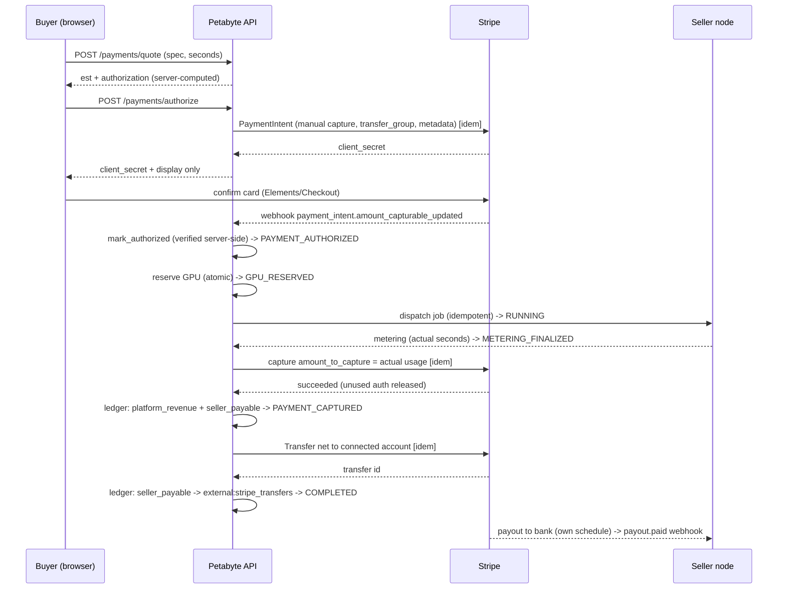

# Stripe Connect Architecture

How Petabyte moves money for a paid compute job. This is the authoritative real-money
path for **per-job compute settlement** (test mode first). It is separate from the
internal **wallet** path (`/deposit`, and the HMAC-verified `POST /webhooks/payment`),
which funds a user's wallet balance. `/deposit` is gated by `PAYMENTS_MODE` (it mints
test credits in `sandbox` and returns 403 in `live`), but the HMAC credit webhook is
**always mounted** — it is not config-gated to a demo mode. The two paths never touch
the same ledger accounts: the wallet path posts to the **dollar-scale** accounts and
the Connect compute path posts to the **minor-unit** accounts (see below), so their
balances are never summed together.

## Components

| File | Role |
|---|---|
| `pricing.py` | Server-side pricing in **integer minor units**; immutable per-transaction snapshot; estimate / settle / refund-split. |
| `stripe_gateway.py` | The only place that talks to Stripe. `RealStripeGateway` (official SDK, every mutation idempotency-keyed) and `FakeStripeGateway` (deterministic, offline; used by tests + demo). Both verify webhooks with the **real** Stripe verifier. |
| `stripe_connect.py` | The service: state machine, onboarding, quote, authorize, reserve, dispatch, meter, capture, transfer, refund/reversal, webhook processing. Every money movement posts to the existing double-entry ledger. |
| `db.py` | Models: `ConnectedAccount`, `ComputeTransaction`, `ComputeTxEvent`, `PaymentOperation`, `StripeWebhookEvent`, `Settlement`; reuses `LedgerTx`/`LedgerEntry`. |
| `main.py` | Thin HTTP endpoints; all amounts computed server-side. |

## Account model & charge type

- **Connected accounts:** Express-style, Stripe-hosted onboarding via Account Links.
  The connected account requests `card_payments` + `transfers` capabilities. The
  controller config makes the **platform the merchant of record** (`fees.payer =
  application`, `losses.payments = application`). Configurable in
  `RealStripeGateway.create_account`.
- **Charge type: separate charges and transfers.** A manual-capture `PaymentIntent`
  is created **on the platform** with a `transfer_group`. Money is captured to the
  platform, then a **`Transfer`** sends the seller's net to their connected account —
  **only after** the job completes and is metered. A destination charge or
  `on_behalf_of` is deliberately **not** used, because it would settle funds to the
  seller before the compute is delivered.

## Money identity

For every settled transaction, in integer minor units:

```
captured_amount == platform_fee_amount + seller_net_amount
```

The Stripe processing fee is borne by the **platform** and tracked **separately**
(`stripe_fee_amount`), never subtracted from the seller's net.

## Ledger accounts (double-entry, reused)

**Unit scales are deliberately separate.** The Connect compute path posts in **integer
minor units** to `*:minor` accounts; the dollar-scale wallet/booking accounts of the
same base name are a *different* account and are never summed with them (see
`db.py`: `EXTERNAL_PAYMENTS`/`PLATFORM_REVENUE` are dollars,
`EXTERNAL_PAYMENTS_MINOR`/`PLATFORM_REVENUE_MINOR` are minor units;
`stripe_connect.py` imports the `*_MINOR` ones aliased to the short names, so every
posting below is on the minor-unit accounts).

| Account | Meaning |
|---|---|
| `external:payments:minor` | The card / customer side (minor units — Connect card clearing). |
| `platform_revenue:minor` | Petabyte's compute commission (minor units). |
| `seller_payable:{id}` | Owed to a seller after capture, before transfer. |
| `external:stripe_transfers` | Money sent out to connected accounts. |
| `stripe:fees` | Processing-fee cost to the platform. |

Postings:
- **Capture:** DEBIT `external:payments:minor` (captured) → CREDIT `platform_revenue:minor` (fee) + CREDIT `seller_payable:{id}` (net). **Plus a separate balanced entry** DEBIT `stripe:fees` → CREDIT `external:payments:minor` (estimated card-processing fee the platform bears).
- **Transfer:** DEBIT `seller_payable:{id}` → CREDIT `external:stripe_transfers` (net).
- **Refund:** CREDIT `external:payments:minor` (refund) ← DEBIT `platform_revenue:minor` (+ DEBIT `seller_payable:{id}` for the seller's share).
- **Transfer reversal:** DEBIT `external:stripe_transfers` → CREDIT `seller_payable:{id}` (clawback).

## End-to-end sequence (successful paid job)



## Trust boundaries

The browser never determines the hourly rate, authorization, final amount, fee,
seller net, or the connected-account destination. All are derived server-side from
the immutable pricing snapshot. Internal settlement operations are admin/service
gated. Webhooks are signature-verified over the raw body and processed at most once.

See also: [PAYMENT_FLOW](PAYMENT_FLOW.md), [SETTLEMENT_AND_LEDGER](SETTLEMENT_AND_LEDGER.md),
[SELLER_ONBOARDING](SELLER_ONBOARDING.md), [STRIPE_WEBHOOKS](STRIPE_WEBHOOKS.md),
[REFUNDS_AND_DISPUTES](REFUNDS_AND_DISPUTES.md), [STRIPE_TESTING](STRIPE_TESTING.md),
[FINANCIAL_RUNBOOK](FINANCIAL_RUNBOOK.md), [PRODUCTION_PAYMENT_CHECKLIST](PRODUCTION_PAYMENT_CHECKLIST.md).
